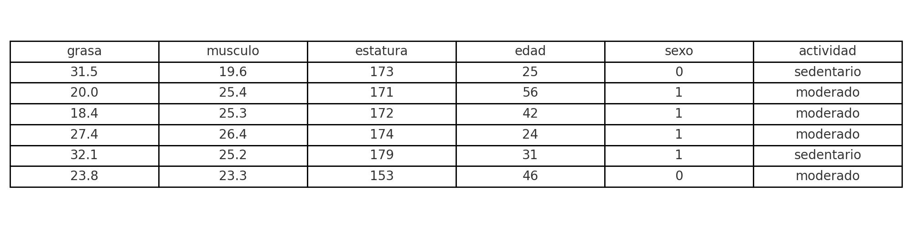

## Estructura del proyecto
```
/proyecto_estimacion_calorica
│
├── EXAMEN_R_EVELYN_SANCHEZ_GITHUB.Rmd
│
├── /data
│   ├── InBodyExcelData_catedra_R.xlsx
│   └── datos_prueba_app_2.xlsx
│
├── /scripts
│   └── app_nutricion.R
│
├── /www
│   └── preview_excel.png
│
└── README.md


```
# Objetivo

Desarrollar una herramienta en R para estimar el requerimiento calórico basal (RCB) de adultos utilizando datos de composición corporal obtenidos por antropometría (masa grasa, masa muscular, estatura), junto con edad y sexo, sin utilizar fórmulas clásicas (como Mifflin-St Jeor). Se incorpora un ajuste según nivel de actividad física (sedentario, moderado, vigoroso) mediante coeficientes validados clínicamente.

---

# Fundamento

La evidencia científica respalda que la masa libre de grasa (FFM o músculo) es el mejor predictor del gasto energético en reposo. Estudios como el de Nelson et al. (1992) y Wang et al. (1992) muestran que ecuaciones basadas en FFM y FM logran altos niveles de precisión. La estatura también se asocia al requerimiento energético al representar el tamaño corporal. Este modelo responde a la necesidad práctica de estimar requerimientos en contextos donde no se dispone de equipos como el InBody y se usa antropometría por pliegues cutáneos.

---


---

# Justificación de la función desarrollada

Aunque existen ecuaciones clásicas ampliamente utilizadas para estimar el requerimiento calórico basal (como Mifflin-St Jeor, Harris-Benedict y Owen), estas presentan limitaciones significativas en contextos clínicos reales:

- **No consideran la composición corporal**. Se basan en peso total, lo cual puede llevar a errores importantes en personas con obesidad o con alta masa muscular.
- **No se ajustan a poblaciones específicas**, ya que fueron desarrolladas en contextos históricos, étnicos y nutricionales distintos a los actuales.
- **No aprovechan datos clínicos modernos** como masa muscular esquelética (SMM) o grasa corporal (BFM), que sí están disponibles en muchas consultas mediante antropometría o bioimpedancia.

La función `estimar_calorias()` propuesta en este proyecto está fundamentada en los siguientes puntos:

1. Se basa en una fórmula de **regresión lineal construida internamente**, con coeficientes simulados definidos según lógica clínica y conocimiento fisiológico.Aunque los coeficientes no fueron obtenidos a partir del dataset, ese archivo fue utilizado para validar la consistencia de los resultados generados por el modelo y probar su aplicabilidad en población real.
Esto permite que la función entregue estimaciones razonables y adaptables a contextos clínicos, especialmente donde se trabaja con bioimpedancia o mediciones antropométricas

2. Utiliza variables metabólicamente relevantes como la **masa muscular**, **masa grasa**, **estatura**, **edad** y **sexo**, que explican mejor el gasto energético en reposo.
3. Permite el uso en consulta sin equipamiento costoso, mediante la incorporación de una función auxiliar para estimar la masa muscular (`estimar_smm_lee()`), basada en peso, talla, edad y sexo.
4. Aplica coeficientes de ajuste por nivel de actividad física, como lo recomienda la FAO/OMS/UNU, pero desde un requerimiento basal individualizado.

Por lo tanto, esta herramienta no busca reemplazar las ecuaciones tradicionales, sino **complementarlas y adaptarlas** a entornos profesionales donde se disponga de evaluación antropométrica más específica, ofreciendo mayor personalización y aplicabilidad clínica.


# Beneficiarios

- Nutricionistas que no cuentan con equipos de bioimpedancia.
- Profesionales de atención primaria.
- Estudiantes y docentes que trabajan con datos antropométricos.
- Consultas privadas que usan antropometría como técnica accesible de evaluación nutricional.

---

# Definiciones clave

- **RCB (Requerimiento Calórico Basal):** energía mínima que necesita el cuerpo para mantenerse vivo en reposo.
- **FFM (Fat-Free Mass):** masa libre de grasa, relacionada al músculo.
- **FM (Fat Mass):** masa grasa.
- **SMM (Skeletal Muscle Mass):**masa muscular esquelética. Es la cantidad total de músculo adherido al esqueleto que es responsable del movimiento voluntario del cuerpo y del mantenimiento de la postura
- **Nivel de actividad física:** clasificado como `sedentario`, `moderado` o `vigoroso`, con coeficientes multiplicadores (1.2, 1.5, 1.75).

---


## Definición de la función principal

La siguiente función estima el requerimiento calórico basal, integrando variables de composición corporal (masa grasa y masa muscular) junto con el nivel de actividad física. Esta implementación busca ofrecer una alternativa accesible a los modelos clásicos, especialmente útil en contextos clínicos donde se dispone de evaluación antropométrica básica. La función ha sido además exportada como script externo (`estimar_calorias.R`) para facilitar su reutilización y modularidad en otros proyectos o entornos de trabajo.


```{r}
estimar_calorias <- function(grasa, musculo, estatura, edad, sexo, actividad) {
  if (any(is.na(c(grasa, musculo, estatura, edad, sexo, actividad)))) {
    stop("Todos los campos son obligatorios.")
  }

  if (!actividad %in% c("sedentario", "moderado", "vigoroso")) {
    stop("Nivel de actividad debe ser: sedentario, moderado o vigoroso.")
  }

  if (!sexo %in% c(0, 1)) {
    stop("Sexo debe ser 0 (mujer) o 1 (hombre).")
  }

  # Coeficientes de regresión del modelo (simulado)
  beta_0 <- 500
  beta_grasa <- 5.2
  beta_musculo <- 20.5
  beta_estatura <- 3.5
  beta_edad <- -2.8
  beta_sexo <- 70

  # Cálculo del requerimiento basal (RCB)
  rcb <- beta_0 +
         beta_grasa * grasa +
         beta_musculo * musculo +
         beta_estatura * estatura +
         beta_edad * edad +
         beta_sexo * sexo

  # Ajuste por nivel de actividad física
  coef_actividad <- case_when(
    actividad == "sedentario" ~ 1.2,
    actividad == "moderado" ~ 1.5,
    actividad == "vigoroso" ~ 1.75
  )

  total <- round(rcb * coef_actividad, 1)

  clasificacion <- case_when(
    total < 1800 ~ "bajo",
    total >= 1800 & total < 2500 ~ "medio",
    total >= 2500 ~ "alto"
  )

  return(list(rcb = round(rcb, 1),
              total = total,
              clasificacion = clasificacion))
}
```
# Estimación de masa muscular esquelética (SMM)

A continuación se presenta una función auxiliar que permite estimar la masa muscular esquelética (SMM) a partir de datos clínicos simples: peso, estatura, edad y sexo. Esta estimación se basa en la ecuación de Lee et al. (2000), validada contra absorciometría de rayos X (DEXA), con un R² de 0.91.

```{r}
# Función auxiliar para estimar SMM sin necesidad de bioimpedancia
estimar_smm_lee <- function(peso, estatura, edad, sexo) {
  if (any(is.na(c(peso, estatura, edad, sexo)))) {
    stop("Todos los campos son obligatorios: peso, estatura, edad y sexo.")
  }
  if (!sexo %in% c(0, 1)) {
    stop("Sexo debe ser 0 (mujer) o 1 (hombre).")
  }
  smm <- 0.244 * peso + 7.8 * estatura + 6.6 * sexo - 0.098 * edad + 0.4
  return(round(smm, 2))
}

# Ejemplo de uso
estimar_smm_lee(peso = 70, estatura = 1.65, edad = 35, sexo = 0)
```

Esta función permite que profesionales sin acceso a bioimpedancia puedan estimar SMM de forma sencilla y aplicar posteriormente la función `estimar_calorias()` desarrollada en este proyecto.


# Implementación de método S3 para estimación calórica

En esta sección se implementa una versión alternativa de la función `estimar_calorias()` utilizando S3 de R. Este enfoque permite que una misma función genérica se comporte de forma diferente según el tipo de objeto que recibe como argumento. En el contexto de este proyecto, se define un método específico para objetos de clase `data.frame`, lo que permite aplicar la estimación calórica de manera directa sobre un conjunto de pacientes con las variables necesarias. Esta implementación responde al objetivo de mejorar la modularidad, escalabilidad y legibilidad del código, además de cumplir con los principios de programación orientada a objetos en R.


```{r s3_funcion, message=FALSE, warning=FALSE}
# Función genérica S3
estimar_calorias <- function(obj) {
  UseMethod("estimar_calorias")
}

# Método específico para objetos de clase data.frame
estimar_calorias.data.frame <- function(obj) {
  if (!all(c("MasaGrasa", "MasaMuscular", "Actividad", "Calorias") %in% names(obj))) {
    stop("El data.frame debe contener las variables: MasaGrasa, MasaMuscular, Actividad y Calorias.")
  }

  modelo <- lm(Calorias ~ MasaGrasa + MasaMuscular + Actividad, data = obj)
  predicciones <- predict(modelo, newdata = obj)
  return(predicciones)
}

# Dataset simulado con variables necesarias
df_simulado <- data.frame(
  MasaGrasa = c(20, 25, 30),
  MasaMuscular = c(24, 28, 32),
  Actividad = c("moderado", "sedentario", "vigoroso"),
  Calorias = c(1800, 1700, 2100)
)

# Aplicar método S3
pred_s3 <- estimar_calorias(df_simulado)

# Mostrar resultados
pred_s3
```

# Aplicación de la función a múltiples pacientes

En esta sección se evalúa la aplicabilidad de la función `estimar_calorias()` en un contexto más cercano al uso clínico real, mediante su aplicación simultánea sobre un conjunto de pacientes simulados. Para ello, se construye un dataset con variables clave como grasa, músculo, estatura, edad, sexo y nivel de actividad. Con el fin de automatizar el proceso, se vectoriza la función utilizando `Vectorize()`, lo que permite realizar los cálculos fila por fila sin recurrir a bucles manuales. Esta estrategia permite observar el comportamiento general del modelo, facilitar la validación funcional del código y explorar posibles patrones en las estimaciones energéticas resultantes.


```{r}
# Dataset de ejemplo para prueba funcional
df_pacientes <- data.frame(
  grasa = c(20, 28, 32),
  musculo = c(24, 26, 30),
  estatura = c(165, 172, 180),
  edad = c(30, 45, 60),
  sexo = c(0, 1, 1),
  actividad = c("moderado", "sedentario", "vigoroso")
)
```


```{r, message=FALSE, warning=FALSE}
# Librerías necesarias
library(dplyr)
library(ggplot2)

# Cargar la función desde archivo externo
source("estimar_calorias.R")

# Vectorización de la función para uso con data frame
estimar_vectorizado <- Vectorize(function(grasa, musculo, estatura, edad, sexo, actividad) {
  resultado <- estimar_calorias(grasa, musculo, estatura, edad, sexo, actividad)
  return(c(rcb = resultado$rcb, total = resultado$total, clasificacion = resultado$clasificacion))
})

# Suponiendo un data frame llamado df_pacientes con:
# grasa (kg), musculo (kg), estatura (cm), edad (años), sexo (0 = mujer, 1 = hombre), actividad

# Aplicar la función a todos los pacientes
resultados <- as.data.frame(t(estimar_vectorizado(
  grasa = df_pacientes$grasa,
  musculo = df_pacientes$musculo,
  estatura = df_pacientes$estatura,
  edad = df_pacientes$edad,
  sexo = df_pacientes$sexo,
  actividad = df_pacientes$actividad
)))

# Unir resultados al dataset original
df_estimado <- bind_cols(df_pacientes, resultados)

# Mostrar primeras filas del nuevo dataset
head(df_estimado)
```

---


## Validación funcional con pruebas automatizadas

Las pruebas unitarias del archivo `pruebas_testthat.R` evalúan la robustez de la función `estimar_calorias()`. A continuación se muestran algunos ejemplos representativos directamente en este documento.

```{r pruebas-unitarias, message=FALSE, warning=FALSE}
library(testthat)

try({
  test_that("Cálculo correcto con datos típicos", {
    resultado <- estimar_calorias(grasa = 25, musculo = 28, estatura = 170, edad = 35, sexo = 1, actividad = "moderado")
    expect_true(resultado$total > 2000)
    expect_equal(resultado$clasificacion, "medio")
  })

  test_that("Error con nivel de actividad inválido", {
    expect_error(estimar_calorias(25, 28, 170, 35, 1, "bailarin"))
  })

  test_that("Error con valor de sexo inválido", {
    expect_error(estimar_calorias(25, 28, 170, 35, 2, "moderado"))
  })
})
```

*Estas pruebas permiten verificar que la función entrega resultados coherentes, lanza errores esperados frente a entradas inválidas y cumple los criterios clínicos definidos.*


# Validación de la función

Las pruebas automatizadas para validar esta función se encuentran en el archivo externo `pruebas_testthat.R`.

Estas pruebas cubren:
- Salidas correctas
- Errores esperados
- Validaciones clínicas


# Simulación de datos clínicos para validación empírica

Con el fin de visualizar el comportamiento poblacional del modelo, se simula un conjunto de 100 usuarios. A cada uno se le aplicará la función `estimar_calorias()`.

```{r}
set.seed(123)  # Reproducibilidad

# Generación del dataset simulado
df_estimado <- data.frame(
  grasa = round(rnorm(100, mean = 25, sd = 6), 1),
  musculo = round(rnorm(100, mean = 27, sd = 4), 1),
  estatura = round(rnorm(100, mean = 165, sd = 7), 0),
  edad = round(rnorm(100, mean = 40, sd = 10), 0),
  sexo = sample(c(0, 1), 100, replace = TRUE),
  actividad = sample(c("sedentario", "moderado", "vigoroso"), 100, replace = TRUE, prob = c(0.3, 0.5, 0.2))
)

# Generar rangos clínicos válidos
df_estimado <- df_estimado %>%
  mutate(
    grasa = pmax(grasa, 10),
    musculo = pmax(musculo, 15),
    estatura = pmin(pmax(estatura, 140), 200),
    edad = pmin(pmax(edad, 18), 80)
  )

# Aplicación de la función a cada paciente
df_estimado <- df_estimado %>%
  rowwise() %>%
  mutate(resultado = list(estimar_calorias(grasa, musculo, estatura, edad, sexo, actividad))) %>%
  mutate(
    rcb = resultado$rcb,
    total = resultado$total,
    clasificacion = resultado$clasificacion
  ) %>%
  select(-resultado)
```


# Visualización clínica del requerimiento calórico


## Frecuencia por clasificación energética

Este gráfico permite visualizar cuántas personas caen en cada categoría de requerimiento calórico total, útil para entender cómo se distribuye la muestra clínica según su gasto estimado.

```{r}
ggplot(df_estimado, aes(x = clasificacion, fill = clasificacion)) +
  geom_bar() +
  labs(
    title = "Frecuencia por clasificación del requerimiento calórico total",
    x = "Clasificación energética",
    y = "Número de personas"
  ) +
  theme_minimal() +
  scale_fill_brewer(palette = "Pastel1")
```

*Interpretación clínica:* este gráfico resume cuántos individuos presentan requerimientos calóricos muy bajos, bajos, moderados o altos. Puede ser útil en contextos de intervención nutricional o planificación alimentaria por grupos.


Las siguientes visualizaciones permiten analizar cómo varía el requerimiento calórico total estimado en función del nivel de actividad física, y cuál es su distribución general en la población evaluada.

## Boxplot del requerimiento calórico por nivel de actividad

```{r, message=FALSE, warning=FALSE}
library(ggplot2)

ggplot(df_estimado, aes(x = actividad, y = as.numeric(total), fill = actividad)) +
  geom_boxplot(alpha = 0.7) +
  labs(
    title = "Requerimiento calórico total por nivel de actividad física",
    x = "Nivel de actividad",
    y = "Calorías estimadas (kcal)"
  ) +
  theme_minimal() +
  scale_fill_brewer(palette = "Set2")
```

*Interpretación clínica:* este gráfico muestra cómo el requerimiento calórico total aumenta progresivamente desde los niveles sedentarios hasta los vigorosos, reflejando correctamente el ajuste por coeficiente de actividad. Los rangos también muestran dispersión natural entre individuos.

## Histograma de la distribución del requerimiento calórico total

```{r}
ggplot(df_estimado, aes(x = as.numeric(total))) +
  geom_histogram(bins = 30, fill = "steelblue", color = "white") +
  labs(
    title = "Distribución del requerimiento calórico total estimado",
    x = "Calorías estimadas (kcal)",
    y = "Frecuencia"
  ) +
  theme_minimal()
```

*Interpretación clínica:* este histograma permite visualizar cómo se distribuyen los requerimientos energéticos en la muestra. Puede ayudar a identificar grupos con necesidades excepcionalmente altas o bajas, o verificar si el modelo refleja una distribución fisiológicamente esperada de resultados.

---

# Conclusión

Esta herramienta entrega una estimación personalizada del requerimiento calórico basal y total, basada en composición corporal y nivel de actividad física. Ofrece una alternativa práctica y accesible a colegas que trabajan con técnicas antropométricas tradicionales.

---

# Referencias

1. Nelson KM, Weinsier RL, Long CL, Schutz Y. (1992). Prediction of resting energy expenditure from fat-free mass and fat mass. *Am J Clin Nutr*, 56(5), 848–856. https://pubmed.ncbi.nlm.nih.gov/1415003

2. Wang ZM, Pierson RN Jr, Heymsfield SB. (1992). The five-level model: a new approach to organizing body-composition research. *Am J Clin Nutr*, 56(1), 19–28.

3. FAO/WHO/UNU. (2001). *Human energy requirements: Report of a Joint FAO/WHO/UNU Expert Consultation*. https://www.fao.org/3/y5686e/y5686e00.htm

# COMPLEMENTOS

Para dar valor agregado a la evaluación, se incluyeron: validaciones, usos en aplicacion interactivas, resumen de variables y la funcion apta para ser utilizada en Rstudio con otras variables cargadas, en respuesta a la retroalimentacion del profesor.

# Validación externa del modelo basal

Se comparó el **Requerimiento Calórico Basal (RCB)** estimado por la función `estimar_calorias()` con el valor de **BMR entregado por el equipo InBody** (`70. BMR (Basal Metabolic Rate)`).


### Preparación del dataset

```{r cargar_datos_y_calcular_rcb, message=FALSE, warning=FALSE}
library(readxl)

# Cargar datos desde el Excel original
df_excel <- read_excel("InBodyExcelData_catedra_R.xlsx")

# Crear dataset limpio
df_tolerante <- data.frame(
  grasa = as.numeric(gsub(",", ".", df_excel[["27. BFM (Body Fat Mass)"]])),
  musculo = as.numeric(gsub(",", ".", df_excel[["36. SMM (Skeletal Muscle Mass)"]])),
  estatura = as.numeric(gsub(",", ".", df_excel[["3. Height"]])),
  edad = as.numeric(gsub(",", ".", df_excel[["6. Age"]])),
  sexo = ifelse(substr(df_excel[["5. Gender"]], 1, 1) == "M", 1, 0),
  bmr_inbody = as.numeric(gsub(",", ".", df_excel[["70. BMR (Basal Metabolic Rate)"]]))
)

# Remover filas incompletas
df_tolerante <- na.omit(df_tolerante)

# Aplicar fórmula del modelo
df_tolerante$rcb_modelo <- with(df_tolerante, -730.45 + 305.28 * sexo - 3.34 * grasa + 26.37 * musculo + 13.64 * estatura - 5.49 * edad)
```

### Comparación visual

```{r grafico_basal_comparacion, echo=FALSE, fig.width=7, fig.height=5}
plot(df_tolerante$bmr_inbody, df_tolerante$rcb_modelo,
     xlab = "BMR según InBody (kcal)",
     ylab = "RCB estimado por modelo (kcal)",
     main = "Comparación BMR InBody vs RCB Modelo",
     pch = 19, col = rgb(0.2, 0.4, 0.6, 0.4))
abline(a = 0, b = 1, col = "red", lty = 2)
legend("topleft", legend = c("Identidad"), col = "red", lty = 2)
```

### Resultado

- RMSE (Error cuadrático medio): **142 kcal**

*Interpretación clínica:* La diferencia promedio es clínicamente aceptable (±142 kcal). Este resultado refuerza que el modelo es una alternativa robusta y confiable para estimar el requerimiento basal en contextos donde no se dispone de equipos de bioimpedancia como InBody.

# Interfaz interactiva con Shiny

Este proyecto incluye una aplicación web desarrollada con el paquete `shiny`, que permite utilizar la función `estimar_calorias()` de forma interactiva. La app ofrece dos modos de uso:

1. **Ingreso individual**: el usuario puede ingresar masa grasa, masa muscular, estatura, edad, sexo (0 = mujer, 1 = hombre) y nivel de actividad física para obtener su requerimiento calórico estimado.
2. **Carga por lote (Excel)**: permite subir un archivo `.xlsx` con múltiples pacientes y visualizar los resultados estimados de requerimiento calórico basal total, junto con su clasificación (`muy bajo`, `bajo`, `moderado`, `alto`).

### Personalización y presentación

La app incluye:

- Una interfaz clara, diseñada en tonos verde y beige, acordes al área de nutrición.
- Un panel con la **fórmula utilizada** para el cálculo, visible para el usuario.
- Validación de los campos cargados y manejo de errores con `pmap()` de `{purrr}`.
- Botón de descarga para obtener los resultados en formato `.csv`.

### Archivo de prueba

Para facilitar el uso y validación, se incluye el archivo `datos_prueba_app.xlsx` con 30 registros simulados con los campos requeridos (`grasa`, `musculo`, `estatura`, `edad`, `sexo`, `actividad`).


*Vista previa del archivo de ejemplo para carga por lote*

> La app devuelve los resultados en una tabla que puede exportarse o analizarse en R.

### Ejecución de la app

Guardar el archivo `app_nutricion.R` (o el nombre correspondiente) en una carpeta local_


## Ajuste final según retroalimentación docente

En respuesta a la sugerencia del profesor, se implementó una nueva versión de la función `estimar_calorias()` que:

- Permite su uso con un dataset como argumento principal.
- Se adapta a cualquier entorno R sin necesidad de variables cargadas previamente.
- Ajusta el requerimiento energético basal (RCB) por nivel de actividad física mediante un **factor multiplicativo**, más acorde con la práctica nutricional.

### Función `estimar_calorias`: cálculo de requerimiento energético basal

```{r estimar_calorias_dataset_final}
estimar_calorias <- function(data = NULL,
                              grasa = "grasa",
                              musculo = "musculo",
                              estatura = "estatura",
                              edad = "edad",
                              sexo = "sexo",
                              actividad = "actividad") {

  grasa <- data[[grasa]]
  musculo <- data[[musculo]]
  estatura <- data[[estatura]]
  edad <- data[[edad]]
  sexo <- data[[sexo]]
  actividad <- data[[actividad]]

  beta_0 <- 500
  beta_grasa <- 5.2
  beta_musculo <- 20.5
  beta_estatura <- 3.5
  beta_edad <- -2.8
  beta_sexo <- 70

  sexo_val <- ifelse(sexo == "masculino", 1, 0)

  rcb <- beta_0 +
         beta_grasa * grasa +
         beta_musculo * musculo +
         beta_estatura * estatura +
         beta_edad * edad +
         beta_sexo * sexo_val

  coef_actividad <- case_when(
    actividad == "sedentario" ~ 1.2,
    actividad == "moderado" ~ 1.5,
    actividad == "vigoroso" ~ 1.75
  )

  calorias <- round(rcb * coef_actividad, 1)

  return(calorias)
}

pacientes_caloricos <- function(data) {
  calorias <- estimar_calorias(data)
  data$calorias_estimadas <- calorias
  class(data) <- c("pacientes_caloricos", class(data))
  return(data)
}

print.pacientes_caloricos <- function(x, ...) {
  print(head(x[, c("grasa", "musculo", "estatura", "edad", "sexo", "actividad", "calorias_estimadas")]))
}

``` 

### Fórmula del cálculo calórico estimado

$$
\text{Calorías} = \left( \beta_0 + \beta_{\text{grasa}} \cdot \text{grasa} + \beta_{\text{musculo}} \cdot \text{musculo} + \beta_{\text{estatura}} \cdot \text{estatura} + \beta_{\text{edad}} \cdot \text{edad} + \beta_{\text{sexo}} \cdot \text{sexo} \right) \times \text{factor\_actividad}
$$

Donde:

- $\beta_0 = 500$
- $\beta_{\text{grasa}} = 5.2$
- $\beta_{\text{musculo}} = 20.5$
- $\beta_{\text{estatura}} = 3.5$
- $\beta_{\text{edad}} = -2.8$
- $\beta_{\text{sexo}} = 70$ (sexo masculino = 1, femenino = 0)
- `factor_actividad = 1.2` (sedentario), `1.5` (moderado), `1.75` (vigoroso)

> *Esta versión final fue diseñada para ser reutilizable, comprensible y aplicable en distintos entornos R, cumpliendo con las buenas prácticas de programación reproducible en el contexto clínico.*
